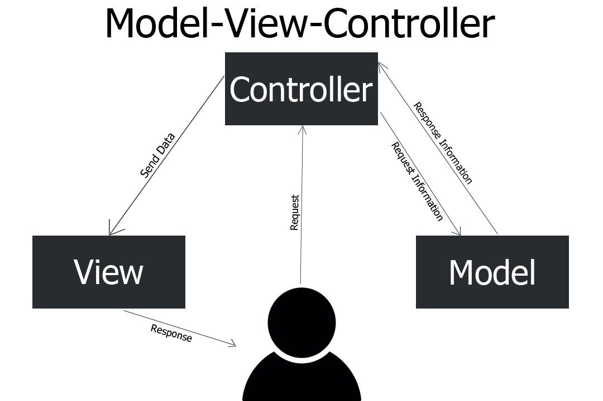

## 📊 **¿Qué es MVC?**

La arquitectura **MVC (Modelo-Vista-Controlador)** es un **patrón de diseño** utilizado para dividir una aplicación en tres partes principales. Este enfoque separa la lógica de negocio, la presentación y el control, haciendo que el código sea más **organizado, escalable y fácil de mantener**.

Las **tres capas** principales son:

1. **Model (Modelo):**

   - Representa la **lógica de negocio** y la **gestión de datos**.
   - Se conecta a bases de datos, APIs o cualquier fuente de datos.
   - Ejemplo: Consulta de usuarios en una base de datos.

2. **View (Vista):**

   - Es la **interfaz de usuario (UI)**.
   - Solo muestra los datos que le proporciona el **Controller**.
   - Ejemplo: Páginas HTML o plantillas con los resultados de una búsqueda.

3. **Controller (Controlador):**
   - **Gestiona las solicitudes (requests)** del usuario.
   - Interactúa con el **Model** y actualiza la **View**.
   - Ejemplo: Procesa formularios y envía la respuesta adecuada.

---

## 🔄 **Cómo Funciona MVC en una Aplicación Web**

1. El usuario **hace una petición (request)** desde el navegador.
2. El **Controller** recibe la petición y decide qué hacer:
   - Puede pedir datos al **Model** o procesar lógica de negocio.
3. El **Model** obtiene los datos (por ejemplo, de una base de datos).
4. El **Controller** envía los datos a la **View**.
5. La **View** genera una **respuesta (response)** en formato HTML, JSON, etc.
6. El navegador **muestra la respuesta** al usuario.

✅ **Flujo unidireccional**: Usuario → Controlador → Modelo → Vista → Usuario.

---

### 📊 **Diagrama de MVC**

```
[Usuario] → [Controlador] → [Modelo] → [Vista] → [Usuario]
```

---

## 📂 **Estructura de un Proyecto MVC en una Web**

Una estructura típica de archivos en un proyecto web con MVC puede ser:

```
/mi_app
├── /controllers    --> Lógica de control
│     └── UsuarioController.php
├── /models         --> Lógica de negocio (datos)
│     └── Usuario.php
├── /views          --> Plantillas (HTML, CSS)
│     └── usuario_view.php
└── index.php       --> Punto de entrada principal
```

---

## 🛠️ **Ejemplo Práctico de MVC en una Web (PHP)**

🎯 **Objetivo:** Mostrar una lista de usuarios desde una base de datos.

---

### 📌 1️⃣ **Model (Usuario.php)**

```php
<?php
class Usuario {
    private $db;

    public function __construct($conexion) {
        $this->db = $conexion;
    }

    public function obtenerUsuarios() {
        $query = "SELECT * FROM usuarios";
        $resultado = $this->db->query($query);
        return $resultado->fetch_all(MYSQLI_ASSOC);
    }
}
```

📌 **¿Qué hace este código?**

- **Conecta a la base de datos** (a través de `$conexion`).
- **Consulta** todos los usuarios (`SELECT * FROM usuarios`).

---

### 📌 2️⃣ **Controller (UsuarioController.php)**

```php
<?php
require_once 'models/Usuario.php';
require_once 'config/db.php';

class UsuarioController {
    public function listarUsuarios() {
        $usuarioModel = new Usuario($conexion);
        $usuarios = $usuarioModel->obtenerUsuarios();
        require_once 'views/usuario_view.php';
    }
}

// Ejecutar controlador
$controller = new UsuarioController();
$controller->listarUsuarios();
```

📌 **¿Qué hace este código?**

- Carga el modelo (`Usuario.php`).
- Llama al método `obtenerUsuarios()` para conseguir los datos.
- Muestra la vista `usuario_view.php` con esos datos.

---

### 📌 3️⃣ **View (usuario_view.php)**

```php
<!DOCTYPE html>
<html lang="es">
<head>
    <title>Lista de Usuarios</title>
</head>
<body>
    <h1>Usuarios Registrados</h1>
    <ul>
        <?php foreach($usuarios as $usuario): ?>
            <li><?= htmlspecialchars($usuario['nombre']); ?></li>
        <?php endforeach; ?>
    </ul>
</body>
</html>
```

📌 **¿Qué hace este código?**

- Recibe los datos del **Controlador** (`$usuarios`).
- Los muestra en una lista `<ul>` de forma segura con `htmlspecialchars()`.

---

### 📌 4️⃣ **Configuración de la Base de Datos (config/db.php)**

```php
<?php
$conexion = new mysqli('localhost', 'root', '', 'mi_base_de_datos');
if ($conexion->connect_error) {
    die("Error en la conexión: " . $conexion->connect_error);
}
```

---

### 📌 5️⃣ **Punto de Entrada (index.php)**

```php
<?php
require_once 'controllers/UsuarioController.php';
```

---

## 🚀 **Cómo Probar el Proyecto**

1. Asegúrate de tener **XAMPP o un servidor local** funcionando.
2. Crea una base de datos llamada `mi_base_de_datos` con una tabla:

   ```sql
   CREATE TABLE usuarios (
       id INT AUTO_INCREMENT PRIMARY KEY,
       nombre VARCHAR(100) NOT NULL
   );

   INSERT INTO usuarios (nombre) VALUES ('John'), ('Ana'), ('Luis');
   ```

3. Visita `http://localhost/mi_app/index.php`.

---

## 📊 **Ventajas y Desventajas de MVC**

| **Ventajas**                            | **Desventajas**                                      |
| --------------------------------------- | ---------------------------------------------------- |
| ✅ **Separación de responsabilidades.** | ❌ Puede ser **complejo** en proyectos pequeños.     |
| ✅ **Mantenibilidad y escalabilidad.**  | ❌ Más archivos = **mayor curva de aprendizaje**.    |
| ✅ Fácil de **probar** cada capa.       | ❌ Requiere más **configuración** inicial.           |
| ✅ **Reutilización** de código.         | ❌ Aumenta la **sobrecarga** si no se gestiona bien. |

---

## 📚 **Mejores Prácticas en MVC para Web**

1. **Separación clara**: No mezcles lógica de negocio (Model) en la vista (View).
2. **Validación y seguridad**: Siempre valida la entrada en el **Controlador**.
3. **Maneja errores**: Usa `try-catch` para controlar errores en el **Model**.
4. **Controladores pequeños**: Divide grandes controladores en **sub-controladores**.
5. **Filtros y Middlewares**: Usa filtros para validar autenticación.

---

## 📘 **Frameworks Web que Usan MVC**

- **PHP**: Laravel, CodeIgniter.
- **Java**: Spring MVC.
- **Python**: Django (MTV: una variación).
- **JavaScript**: Express (Node.js), Angular (MVVM).

## **Diagrama**


