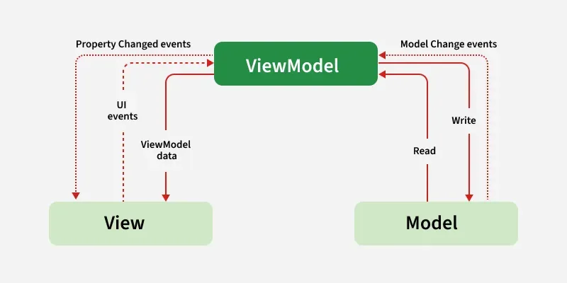

## 🧱 **¿Qué es MVVM?**

MVVM es un **patrón arquitectónico** que organiza tu código en tres capas principales:

1. **Model (Modelo):** Maneja los **datos** y la lógica de negocio.
2. **View (Vista):** Es la **interfaz de usuario (UI)**. Muestra la información y recibe las interacciones del usuario.
3. **ViewModel:** Actúa como un **intermediario** entre el **Model** y la **View**, gestionando la lógica de presentación y el estado de la UI.

👉 **Propósito principal:** Separar la lógica de negocio (Model) de la interfaz gráfica (View) para hacer el código más **modular, testeable y fácil de mantener**.

---

## 📊 **Diagrama de MVVM**

```
Usuario ↔️ View ↔️ ViewModel ↔️ Model ↔️ Base de Datos/API
```

1. **View**: Muestra datos y recibe la interacción del usuario.
2. **ViewModel**: Proporciona datos a la vista y responde a las acciones del usuario.
3. **Model**: Obtiene y almacena los datos (Room, API, etc.).

---

## 🔍 **¿Cómo Funciona MVVM?**

1. El **usuario** interactúa con la **View** (por ejemplo, pulsa un botón).
2. La **View** notifica a la **ViewModel**.
3. La **ViewModel** solicita o procesa los **datos** a través del **Model**.
4. El **Model** devuelve los datos a la **ViewModel**.
5. La **ViewModel** actualiza la **View** con los nuevos datos.

✅ **Flujo de datos unidireccional**: De **Model → ViewModel → View**.  
✅ **Reactividad**: Utiliza **LiveData** o **StateFlow** para reflejar los cambios en tiempo real.

---

## 📦 **Componentes Clave de MVVM en Android**

| Componente     | Descripción                                                                                     |
| -------------- | ----------------------------------------------------------------------------------------------- |
| **Model**      | Fuente de datos (Room, Retrofit, API, etc.).                                                    |
| **View**       | UI (Activity, Fragment, Jetpack Compose).                                                       |
| **ViewModel**  | Maneja el estado de la UI y la lógica de presentación.                                          |
| **LiveData**   | Objeto observable que notifica cambios a la UI.                                                 |
| **StateFlow**  | Alternativa moderna de LiveData basada en coroutines.                                           |
| **Repository** | Fuente de verdad única que abstrae la lógica de acceso a los datos (opcional pero recomendado). |

---

## 🛠️ **Ejemplo Práctico de MVVM en Android (Contador)**

### 1️⃣ **Model (ContadorRepository.kt)**

```kotlin
class ContadorRepository {
    fun incrementar(valor: Int) = valor + 1
}
```

### 2️⃣ **ViewModel (ContadorViewModel.kt)**

```kotlin
import androidx.lifecycle.LiveData
import androidx.lifecycle.MutableLiveData
import androidx.lifecycle.ViewModel

class ContadorViewModel : ViewModel() {
    private val _contador = MutableLiveData(0)
    val contador: LiveData<Int> = _contador
    private val repository = ContadorRepository()

    fun incrementar() {
        _contador.value = repository.incrementar(_contador.value ?: 0)
    }
}
```

### 3️⃣ **View (MainActivity.kt)**

```kotlin
import android.os.Bundle
import androidx.activity.ComponentActivity
import androidx.activity.viewModels
import androidx.compose.foundation.layout.*
import androidx.compose.material3.*
import androidx.compose.runtime.*
import androidx.lifecycle.observeAsState

class MainActivity : ComponentActivity() {
    private val viewModel: ContadorViewModel by viewModels()

    override fun onCreate(savedInstanceState: Bundle?) {
        super.onCreate(savedInstanceState)
        setContent {
            val contador by viewModel.contador.observeAsState(0)

            Column {
                Text("Contador: $contador")
                Button(onClick = { viewModel.incrementar() }) {
                    Text("Incrementar")
                }
            }
        }
    }
}
```

---

## 📚 **Variaciones del Patrón MVVM**

1. **Con Repositorio (Repository Pattern):**
   - Facilita el acceso a múltiples fuentes de datos (API + Room).
2. **StateFlow vs LiveData:**
   - Usa `StateFlow` para un enfoque moderno con coroutines.

---

## 📊 **Diferencias entre MVC, MVP y MVVM**

| Característica        | **MVC**                              | **MVP**                                   | **MVVM**                                                   |
| --------------------- | ------------------------------------ | ----------------------------------------- | ---------------------------------------------------------- |
| **Responsabilidad**   | Controlador maneja todo.             | Presenter tiene lógica y actualiza la UI. | ViewModel gestiona el estado y conecta el Model y la View. |
| **Acoplamiento**      | Alto (View y Controller muy unidos). | Medio (View-Presenter separados).         | Bajo (View-ViewModel desacoplados).                        |
| **Facilidad de Test** | Difícil (UI y lógica juntas).        | Más fácil (presentador separado).         | Más fácil (ViewModel desacoplado).                         |
| **Uso en Android**    | No recomendado.                      | Usado antes de Jetpack.                   | ✅ Recomendado (Jetpack Architecture Components).          |

---

## 📋 **Buenas Prácticas con MVVM**

1. **Separa la lógica de la UI:** Mantén la UI en la **View** y la lógica en el **ViewModel**.
2. **Inmutabilidad:** Usa `LiveData` o `StateFlow` como **val** en lugar de **var**.
3. **Manejo de errores:** Usa un `sealed class` para estados como `Success`, `Loading`, `Error`.
4. **Simplicidad:** No pongas lógica compleja en el ViewModel. Usa un **Repository**.
5. **Jetpack Components:** Usa `ViewModel`, `LiveData`, `Flow`, `Room`, `Navigation`.

---

## 📘 **Recursos para Aprender Más**

- 🔗 [Documentación Oficial de MVVM en Android](https://developer.android.com/topic/libraries/architecture/viewmodel)
- 📚 Aprende a combinar **MVVM + Hilt + Retrofit + Room** para apps robustas.

---

## **Diagrama**


