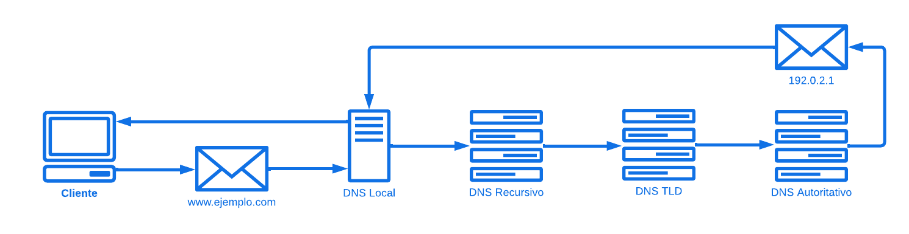

# Sistema DNS

## ¿Qué es?

Por sus siglas **Domain Name System (Sistema de Nombres de Dominio)**, es un sistema fundamental para la funcionalidad de Internet. Su principal propósito es traducir nombres de dominio legibles por humanos (como **www.ejemplo.com**) en direcciones IP (como **192.0.2.1**), que son utilizadas por los dispositivos para comunicarse entre sí en la red.

## ¿Para qué sirve?

* **Resolución de nombres:** Facilita la conversión de nombres de dominio en direcciones IP. Esto es crucial porque los humanos prefieren recordar nombres que números.

* **Distribución de la carga:** Permite que múltiples servidores respondan a solicitudes para un mismo dominio, mejorando la disponibilidad y el rendimiento del servicio.

* **Redundancia y confiabilidad:** Almacena múltiples registros para un mismo dominio, de modo que si un servidor falla, otros pueden tomar su lugar.

* **Dirección de servicios:** Puede proporcionar información sobre otros servicios asociados a un dominio, como servidores de correo electrónico (a través de registros MX).

## Proceso

1. **Consulta del navegador:** Cuando un usuario ingresa una *URL* en su navegador *Cliente*, este primero verifica si la dirección IP ya está almacenada en la caché local del dispositivo.

2. **Consulta al servidor DNS Local:** Si no está en la caché, el navegador envía una solicitud a un servidor *DNS Local* (normalmente proporcionado por el proveedor de servicios de Internet).

3. **Consulta recursiva:** Si el servidor DNS local no tiene la dirección IP en su caché, realizará una consulta *Recursiva*. Esto significa que consultará otros servidores DNS en la jerarquía del sistema.

4. **Consulta a los servidores raíz:** El servidor DNS local enviará una consulta a uno de los servidores raíz. Estos servidores conocen la ubicación de los servidores de dominio de nivel superior, conocido como **"TLD" (Top Level Domain)**, como .com, .org, etc.

5. **Consulta a los servidores TLD:** El servidor raíz responde con la dirección de un servidor *DNS TLD* correspondiente al dominio consultado (por ejemplo, para www.ejemplo.com, el servidor DNS para .com).

6. **Consulta al servidor autoritativo:** El servidor DNS local se comunica con el servidor autoritativo para el dominio específico. Este servidor tiene la información definitiva sobre la dirección IP asociada al nombre de dominio.

7. **Respuesta final:** El servidor autoritativo devuelve la *Dirección IP* al servidor DNS local, que a su vez la envía de vuelta al navegador *Cliente*.

8. **Caché de la dirección IP:** Para optimizar futuras consultas, el servidor DNS local almacenará la dirección IP en su caché durante un tiempo determinado, conocido como **"TTL" (Time To Live)**.

9. **Acceso al recurso:** Finalmente, el navegador utiliza la dirección IP para conectarse al servidor correspondiente y acceder al recurso deseado.

