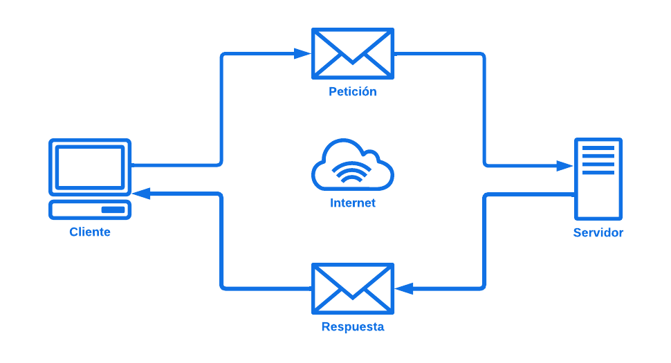
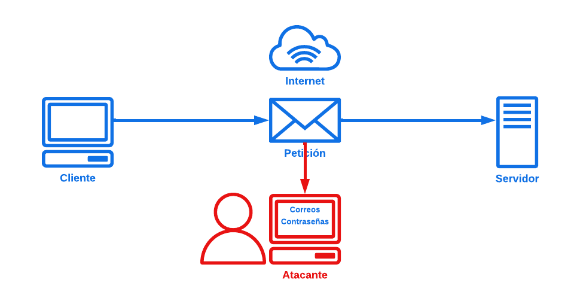

# Protocolo HTTP

## ¿Qué es?

Por sus siglas **HyperText Transfer Protocol (*Protocolo de transferencia de hipertexto*)**, es un conjunto de reglas que permite la comunicación entre un navegador web y un servidor. Su función principal es facilitar la transferencia de información en la web, como páginas HTML, imágenes y otros archivos.

El protocolo consta de los siguientes dos pasos:

1. **Petición:** Cuando escribes una dirección web en tu navegador y presionas "Enter", el navegador envía una solicitud HTTP al servidor donde se encuentra la página.
2. **Respuesta:** El servidor recibe esa solicitud y responde enviando los datos solicitados, como el contenido de la página. El navegador recibe la respuesta y muestra la página web en tu pantalla.

HTTP funciona en un modelo de **"petición-respuesta"**, y es fundamental para que puedas navegar por Internet.



## A tener en cuenta

Este protocolo fue creado entre **1989 y 1991** por **Tim Berners-Lee**, considerando la epoca en la que fue creado, este no consideraba ningún metodo de seguridad. Debido a que no todas las personas en Internet tienen buenas intenciones, este protocolo está vulnerable a todo tipo de ataques para capturar la información que se transfiere por él, ya que este metodo transfiere la información en texto plano sin ningún tipo de enciptación



## Metodos

1. **GET:** Este método se usa para solicitar datos del servidor. Por ejemplo, cuando abres una página web, el navegador utiliza GET para pedirle al servidor la información de esa página.
2. **POST:** Se utiliza para enviar datos al servidor, como cuando completas un formulario en línea (por ejemplo, al registrarte en un sitio web). El servidor recibe la información y puede procesarla.
3. **PUT:** Este método se usa para actualizar o reemplazar datos en el servidor. Si tienes un archivo en el servidor y quieres actualizarlo, usarías PUT.
4. **DELETE:** Como su nombre indica, este método se utiliza para eliminar recursos del servidor. Por ejemplo, si quieres borrar un archivo o una entrada de una base de datos, usarías DELETE.
5. **HEAD:** Similar a GET, pero solo solicita los encabezados de la respuesta, sin el cuerpo del contenido. Esto se utiliza a menudo para obtener información sobre un recurso sin descargarlo.
6. **OPTIONS:** Este método se utiliza para consultar al servidor sobre los métodos HTTP que admite para un recurso específico. Es útil para conocer las capacidades del servidor.
7. **PATCH:** Se utiliza para aplicar modificaciones parciales a un recurso existente. Es como PUT, pero solo actualiza una parte del recurso.

## Estructura

### Petición

1. **Línea de solicitud:** Indica el método, la URL y la versión del protocolo.
```
GET /index.html HTTP/1.1
```
2. **Encabezados (Headers):** Proporcionan información adicional sobre la solicitud, como el tipo de contenido o el agente de usuario.
```
Host: www.ejemplo.com
User-Agent: Mozilla/5.0
Accept: text/html
```
3. **Cuerpo (Body):** En algunos métodos como POST o PUT, se incluye un cuerpo con los datos que se envían al servidor.
```
email=Juan@gmail.com&password=12345678
```

### Respuesta

1. **Línea de estado:** Indica la versión del protocolo, el código de estado y un mensaje de estado.
```
HTTP/1.1 200 OK
```
2. **Encabezados (Headers):** Proporcionan información sobre la respuesta, como el tipo de contenido o la fecha.
```
Content-Type: text/html
Content-Length: 1234
```
3. **Cuerpo (Body):** Contiene los datos que se envían al cliente, como el HTML de la página solicitada.
``` html
<html>
  <head>
    <title>Página de Ejemplo</title>
  </head>
  <body>
    <h1>Hola, Mundo!</h1>
  </body>
</html>
```