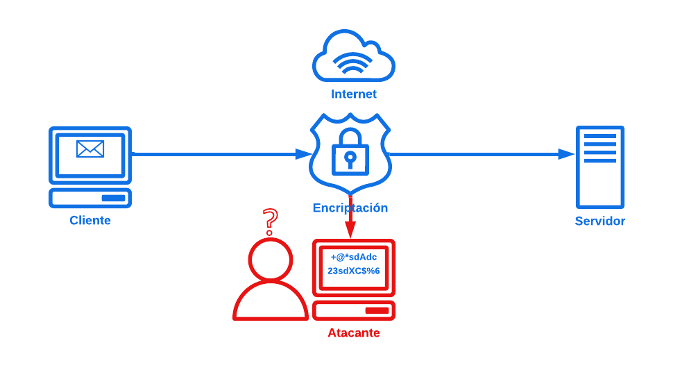

# Protocolo HTTPS

## ¿Qué es?

Por sus siglas **HyperText Transfer Protocol Secure (*Protocolo de transferencia de hipertexto seguro*)**, es una versión segura del protocolo HTTP. Pero ¿qué tiene de diferente?, pues su diferencia fundamental son los siguientes puntos:

* **Seguridad:** HTTPS añade una capa de seguridad al protocolo HTTP. Utiliza un sistema de cifrado que protege la información que envías y recibes a través de Internet. Esto significa que, aunque alguien intente interceptar tus datos, no podrá leerlos.

* **Cifrado:** Cuando te conectas a un sitio web que usa HTTPS, los datos que envías (como contraseñas o información personal) se convierten en un código que solo el servidor puede descifrar. Esto ayuda a mantener tu información privada.

* **Autenticación:** HTTPS también verifica que el sitio web al que te estás conectando es realmente el que dice ser. Esto se hace mediante certificados digitales que aseguran que el sitio es legítimo y no una imitación.

* **Confianza:** Cuando ves un candado en la barra de direcciones de tu navegador, significa que estás en un sitio HTTPS. Esto te da confianza de que tu conexión es segura y que tu información está protegida.

* **Uso común:** HTTPS es esencial en sitios donde se manejan datos sensibles, como bancos, tiendas en línea y redes sociales. Cada vez que ingresas información personal, es mejor que el sitio use HTTPS para garantizar tu seguridad.

