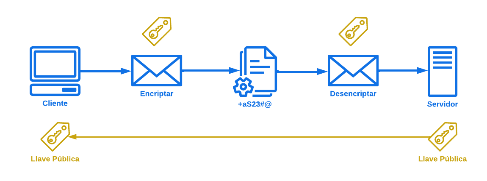

# Protocolo SSH

## ¿Qué es?

Por sus siglas **Secure Shell (Carcasa segura)** es un protocolo de red que permite la administración segura de sistemas y la transferencia de datos a través de redes inseguras, como Internet. SSH proporciona un canal seguro en una red no segura mediante técnicas de cifrado, autenticación y compresión de datos.

## ¿Para qué sirve?

* **Acceso remoto seguro:** SSH permite a los administradores de sistemas acceder y gestionar servidores de manera segura desde ubicaciones remotas, como si estuvieran en la misma red local.

* **Transferencia segura de archivos:** Protocolo como SFTP (SSH File Transfer Protocol) o SCP (Secure Copy Protocol), que permiten la transferencia de archivos de manera segura entre dispositivos.

* **Túneles seguros:** SSH puede crear túneles seguros para redirigir tráfico a través de conexiones inseguras, lo que permite, por ejemplo, acceder a servicios web internos a través de un servidor SSH.

* **Ejecutar comandos de manera segura:** Permite ejecutar comandos de manera remota, lo que es útil para la administración de servidores y la automatización de tareas.

* **Autenticación robusta:** SSH admite varios métodos de autenticación, incluyendo contraseñas y claves públicas, proporcionando un alto nivel de seguridad.

## Proceso

1. **Establecimiento de conexión:** Cuando un cliente desea conectarse a un servidor SSH

    * **Cliente SSH:** El usuario inicia un cliente SSH en su dispositivo e introduce la dirección IP o el nombre de dominio del servidor al que desea conectarse.

    * **Solicitud de conexión:** El cliente envía una solicitud de conexión al servidor SSH.

2. **Negociación de protocolo:** Una vez que el servidor recibe la solicitud

    * **Intercambio de versiones:** El cliente y el servidor intercambian información sobre las versiones del protocolo SSH que soportan.

    * **Selección de algoritmos:** Se negocian los algoritmos de cifrado, autenticación y compresión que utilizarán en la conexión.

3. **Autenticación del servidor:** El cliente necesita asegurarse de que se está conectando al servidor correcto

    * **Intercambio de claves públicas:** El servidor envía su clave pública al cliente.

    * **Verificación de la clave:** El cliente compara la clave pública recibida con la que tiene almacenada (en su archivo de "known_hosts"). Si es la primera vez que se conecta, el cliente puede optar por aceptar la clave o abortar la conexión.

4. **Autenticación del cliente:** Una vez que el servidor es verificado, el cliente debe autenticarse

    * **Métodos de autenticación:** El cliente puede autenticarse mediante diferentes métodos, como:

        * **Contraseña:** El cliente envía su nombre de usuario y contraseña al servidor.

        * **Claves públicas:** El cliente utiliza un par de claves (pública y privada) para autenticarse. El servidor verifica si la clave pública está autorizada para el usuario.

5. **Establecimiento del túnel seguro:** Si la autenticación es exitosa

    * **Establecimiento del canal seguro:** Se crea un túnel seguro utilizando el algoritmo de cifrado negociado. A partir de este punto, todos los datos transmitidos entre el cliente y el servidor están cifrados.

6. **Interacción:**

    * **Ejecutar comandos:** El cliente puede enviar comandos al servidor, y el servidor responde. Por ejemplo, un administrador puede usar el terminal para ejecutar scripts, instalar software o gestionar configuraciones.

    * **Transferencia de archivos:** Utilizando SFTP o SCP, se pueden transferir archivos de forma segura entre el cliente y el servidor.

7. **Cierre de la conexión:** Una vez que se completa el trabajo

    * **Terminación del túnel:** El cliente puede cerrar la sesión, y se termina el túnel seguro. Tanto el cliente como el servidor envían mensajes para finalizar la conexión de manera ordenada.

