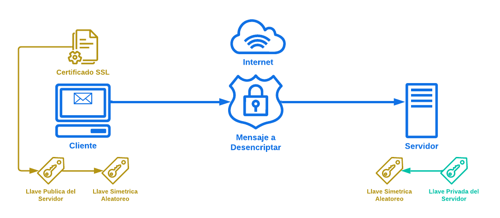

# Protocolo SSL o TLS

## ¿Qué es?

Por sus siglas **Secure Sockets Layer (*Capa de sockets seguros*)**, es un protocolo que se utiliza para asegurar la comunicación entre tu computadora y un servidor en Internet. De manera más sencilla:

* **Seguridad:** SSL ayuda a proteger la información que envías y recibes en línea. Esto es especialmente importante cuando compartes datos sensibles, como contraseñas o información financiera.

* **Cifrado:** Cuando usas SSL, la información se convierte en un código que solo el servidor y tu computadora pueden entender. Esto significa que, si alguien intenta interceptar la comunicación, no podrá leer los datos.

* **Verificación:** SSL también ayuda a comprobar que el sitio web al que te conectas es realmente el que dice ser. Esto se hace a través de certificados que demuestran la identidad del sitio.

* **Uso en HTTPS:** Aunque a menudo se habla de SSL, en la actualidad se usa más su sucesor, TLS (Transport Layer Security). Sin embargo, muchas personas aún lo conocen como SSL. Ambos protocolos se utilizan para hacer que la conexión HTTPS sea segura.

* **Confianza:** Cuando ves un candado en la barra de direcciones de tu navegador, eso indica que SSL (o TLS) está activo. Esto te da confianza de que tu información está protegida.

## Proceso

El proceso que hace el protocolo SSL es el siguiente:

1. El *Cliente* envia un mensaje al *Servidor* diciendo que desea comunicarse de forma segura.

2. El *Servidor* responde enviando su *Certificado SSL* para que el *Cliente* pueda verificar su autenticidad.

3. El navegador obtiene la *Llave Pública del Servidor* que se encuentra en el *Certificado SSL*.

4. El navegador procede a generar la *Llave Simétrica Aleatoria*, que no es más que un numero aleatorio de un tamaño especifico.

5. Se encripta la *Llave Simétrica Aleatoria* utilizando la *Llave Pública del Servidor*, y es enviada al *Servidor*.

6. Una vez llega al *Servidor*, la *Llave Simétrica Aleatoria* es desencriptada utilizando la *Llave Privada del Servidor*.

7. Ahora tanto *Cliente* como *Servidor* tienen la *Llave Simétrica Aleatoria*, esto hace que todos los datos enviados o recibidos por el [Protocolo HTTPS](https://github.com/JohnFRivera/Practicas/blob/master/HTTPS.md "Protocolo HTTPS") puedan ser encriptados o desencriptados facilmente por ambas partes.

## ¿Y el TLS?

Por sus siglas **Transport Layor Sockets (*Transporte para Capa de Sockets*)**, no es más que la versión mejorada de **SSL**, que utiliza metodos criptograficos más actuales y seguros.