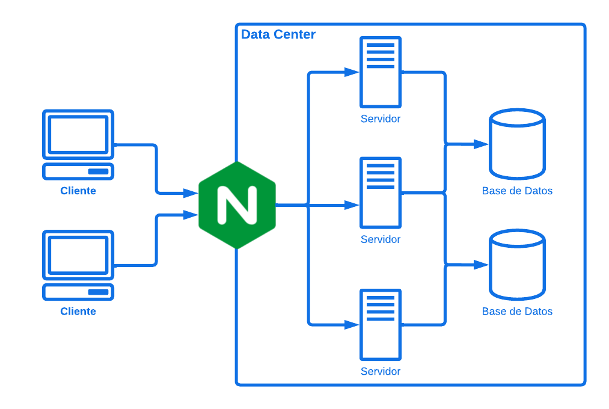

# Servidor NGINX

## ¿Qúe es?

NGINX es un servidor web de código abierto que también funciona como un **proxy inverso**, **balanceador de carga** y **servidor de caché**. Es conocido por su alto rendimiento, estabilidad y bajo consumo de recursos, lo que lo convierte en una opción popular para manejar tráfico web en aplicaciones modernas.

## ¿Para qué sirve?

* **Servidor web:** NGINX puede servir archivos estáticos (como imágenes, HTML, CSS, y JavaScript) de manera muy eficiente. Es capaz de manejar un gran número de conexiones simultáneas, lo que lo hace ideal para sitios de alto tráfico.

* **Proxy inverso:** Como proxy inverso, NGINX recibe solicitudes del cliente y las reenvía a uno o más servidores de aplicaciones. Esto ayuda a distribuir la carga y permite implementar características como [SSL (Secure Sockets Layer)](https://github.com/JohnFRivera/Practicas/blob/master/SSL.md "Protocolo SSL"), autenticación y compresión.

* **Balanceador de carga:** NGINX puede distribuir el tráfico entrante entre varios servidores de backend, mejorando la disponibilidad y escalabilidad de las aplicaciones. Puede usar diferentes algoritmos de balanceo (como round-robin, least connections, entre otros).

* **Servidor de caché:** Puede almacenar en caché las respuestas de los servidores de backend, lo que reduce la carga en estos servidores y mejora el tiempo de respuesta para los clientes.

* **Manejo de conexiones simultáneas:** Gracias a su arquitectura asíncrona, NGINX puede manejar miles de conexiones simultáneamente con un uso de memoria relativamente bajo, lo que lo hace muy eficiente en comparación con servidores tradicionales que utilizan un modelo de proceso por conexión.

* **Reescritura de URL:** Permite redirigir y reescribir URLs, lo que es útil para SEO y para la organización de recursos en el servidor.

## Proceso

1. **Recepción de la solicitud:** Cuando un *Cliente (navegador, API, etc.)* envía una *Solicitud* [HTTP](https://github.com/JohnFRivera/Practicas/blob/master/HTTP.md "Protocolo HTTP") a NGINX, este primero recibe y analiza la solicitud.

2. **Verificación de caché:** NGINX verifica si hay una *Respuesta* almacenada en *Caché* para la solicitud. Si la respuesta está en caché y es válida, NGINX devuelve esa respuesta al *Cliente*, lo que mejora el tiempo de respuesta.

3. **Enrutamiento de la solicitud:** Si no hay respuesta en caché, NGINX utiliza su configuración para determinar cómo manejar la solicitud. Esto puede implicar reenviar la solicitud a uno o más *Servidores* de backend.

4. **Balanceo de carga:** Si se utilizan múltiples servidores de backend, NGINX aplica el algoritmo de balanceo de carga elegido para decidir a cuál *Servidor* enviar la *Solicitud*.

5. **Proceso de la solicitud en el backend:** El *Servidor* de backend recibe la *Solicitud* de NGINX, procesa la solicitud (por ejemplo, consulta una *Base de Datos*, genera contenido dinámico) y envía una *Respuesta* de vuelta a NGINX.

6. **Envío de la respuesta al cliente:** NGINX recibe la *Respuesta* del *Servidor* de backend y, si está configurado, puede almacenar esa respuesta en *Caché* para futuras solicitudes. Luego, envía la respuesta final al *Cliente* que hizo la solicitud.

7. **Registro y monitoreo:** Durante este proceso, NGINX registra información sobre la solicitud y la respuesta, lo que puede ser útil para el monitoreo y análisis del rendimiento.

